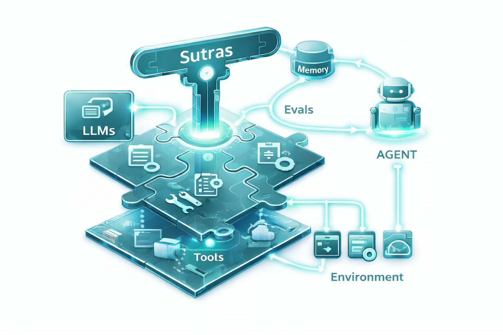

# Sutras

**The developer toolkit for Anthropic Agent Skills.**



Sutras helps you create, test, and share skills for Claude. Whether you're building your first skill or managing a library of them, Sutras handles the tedious parts so you can focus on what your skill does.

## Get Started in 30 Seconds

```sh
# Install
pip install sutras

# Create your first skill
sutras new my-skill --description "Does something awesome"

# That's it! Your skill is ready at .claude/skills/my-skill/
```

## What Can You Do?

**Create Skills** - Generate well-structured skills with one command. No more copy-pasting boilerplate.
```sh
sutras new pdf-helper
```

**Validate & Test** - Catch issues before they cause problems.
```sh
sutras validate my-skill
sutras test my-skill
```

**Share Skills** - Package and publish skills for others to use.
```sh
sutras build my-skill
sutras publish
```

**Install Skills** - Grab skills from registries, GitHub, or local files.
```sh
sutras install @user/skill-name
```

## Why Sutras?

Building Claude skills manually means writing YAML frontmatter, managing metadata, ensuring consistent structure, and validating everything by hand. Sutras automates all of this with simple commands.

| Without Sutras | With Sutras |
|----------------|-------------|
| Create files manually | `sutras new my-skill` |
| Check structure by eye | `sutras validate my-skill` |
| Copy skills between projects | `sutras install @user/skill` |
| Hope tests work | `sutras test my-skill` |

## Learn More

- **[Installation](getting-started/install.md)** - Detailed setup instructions
- **[Quickstart](getting-started/quickstart.md)** - Create your first skill step by step
- **[CLI Reference](cli/index.md)** - All commands and options
- **[Example Skills](https://github.com/anistark/sutras/tree/main/examples/skills/)** - See best practices in action

```{toctree}
:maxdepth: 2
:hidden:

getting-started/index
cli/index
guides/index
contributing/index
```
